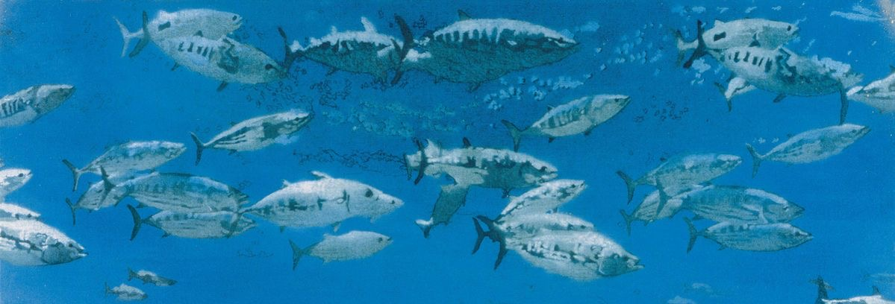
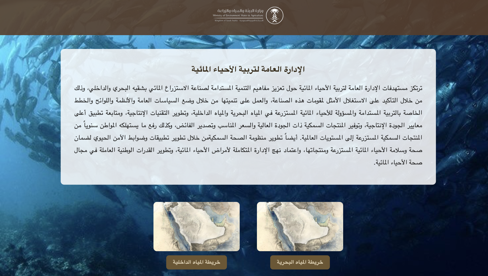
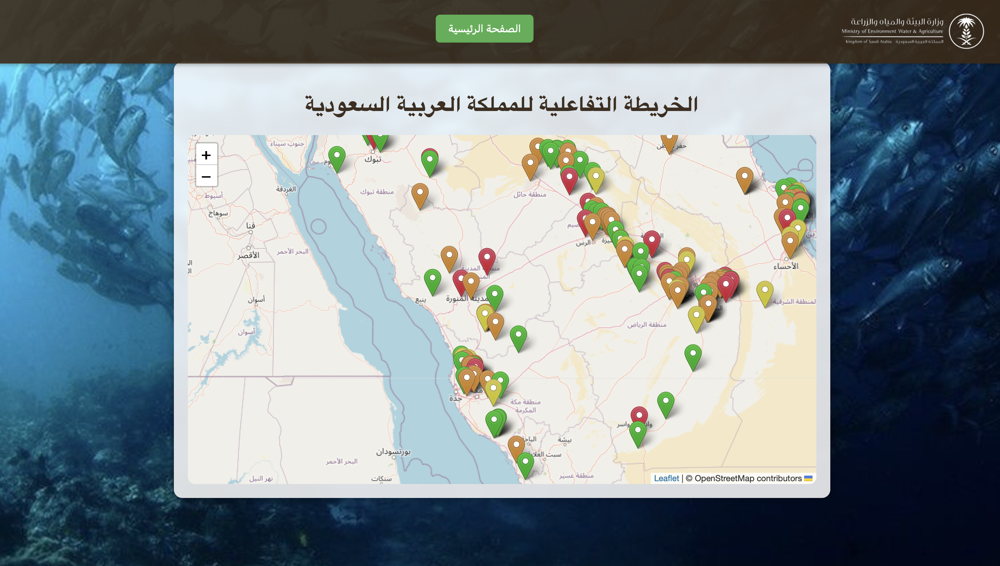
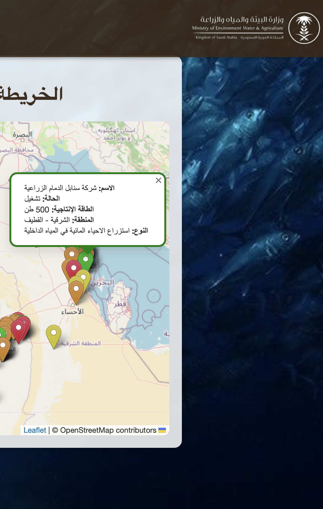

  

<h1 align="center">Saudi Aquaculture Maps</h1>

An interactive web mapping project developed during my cooperative training at the Ministry of Environment, Water and Agriculture.

## 🌐 Live Demo

[View the Live Website](https://saudiaquafarms.netlify.app/)

## ✨ Features

- Interactive aquaculture farm maps
- Marine and inland water maps
- Interactive map navigation
- Visual representation of aquaculture farms in Saudi Arabia

## 🛠️ Technologies

- HTML
- CSS
- JavaScript
- Leaflet
- OpenStreetMap

## 📸 Project Preview

### Home Page

### Aquaculture Farms Map

### Farm Details

